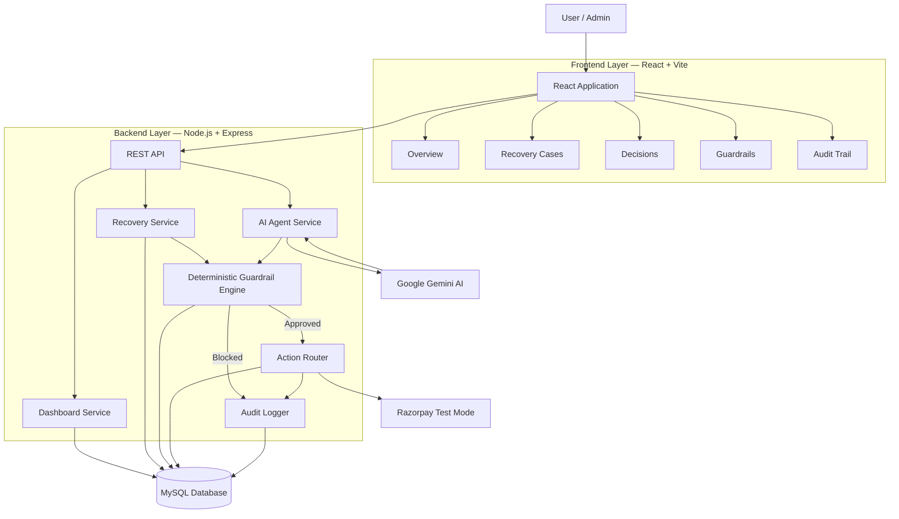
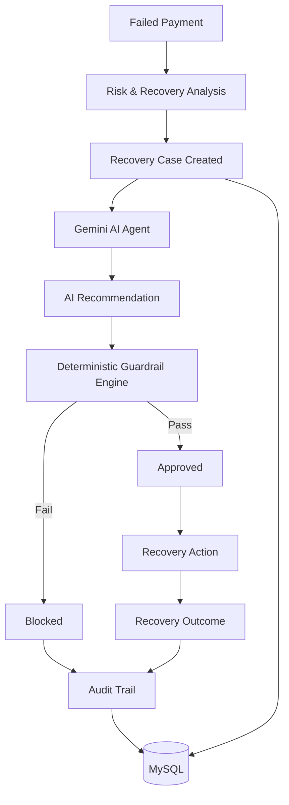
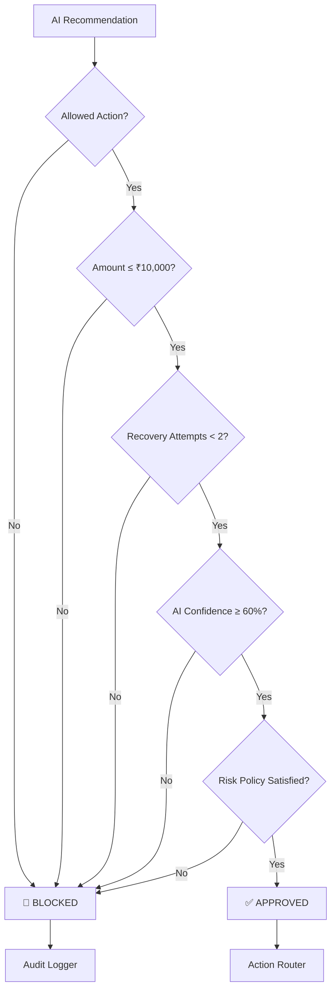
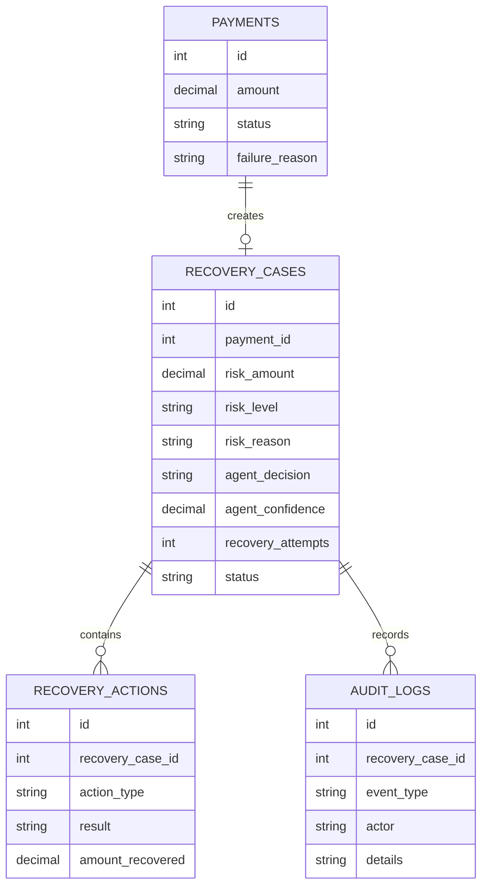

# RecoverAI — AI-Powered Revenue Recovery Platform

## Overview

RecoverAI is an AI-powered fintech platform designed to help businesses recover revenue lost due to failed payments.

Instead of treating every failed payment the same way, RecoverAI analyzes each case, evaluates its risk, and uses an AI recovery agent to recommend the most appropriate recovery action. Before any automated action is executed, the recommendation is checked against predefined business guardrails.

The platform is designed around the principle:

**AI recommends → Guardrails validate → System executes → Audit records**

---

## Problem

Failed payments can result in significant revenue loss. Manually reviewing every failed transaction is time-consuming and can lead to inconsistent recovery decisions.

Businesses need a system that can:

- Identify payments that require recovery.
- Prioritize cases based on risk.
- Recommend suitable recovery actions.
- Prevent unsafe automated actions.
- Track whether recovery attempts succeed or fail.
- Maintain an audit history of decisions.

---

## Solution

RecoverAI provides an end-to-end recovery workflow.

When a failed payment is identified, the system creates a recovery case and analyzes factors such as:

- Payment amount
- Failure reason
- Risk level
- Previous recovery attempts
- AI confidence

The Gemini-powered AI agent then recommends an action.

The recommendation is passed through the Guardrail Engine before execution. If the recommendation violates a configured policy, it is blocked instead of being executed.

---

## Core Features

### 1. Revenue Recovery Analysis

The system analyzes failed payment data and creates recovery cases based on the payment and risk information.

### 2. AI Recovery Agent

Gemini AI evaluates recovery cases and recommends one of the supported actions:

- Send Recovery Link
- Retry Payment
- Wait and Retry
- Escalate
- No Action

The AI also provides a confidence level and reasoning for its recommendation.

### 3. Guardrail Engine

RecoverAI does not allow the AI to directly control recovery actions.

Every recommendation is checked against predefined policies, including:

- Maximum recovery amount
- Maximum recovery attempts
- Minimum AI confidence
- Low-risk recovery restrictions
- Allowed recovery actions

If a recommendation violates a policy, the system blocks it.

### 4. Recovery Outcome Tracking

The platform records whether a recovery attempt succeeds or fails.

Successful recovery updates the recovered amount, while failed attempts increase the recovery attempt count.

Once the maximum number of attempts is reached, further recovery is stopped.

### 5. Dashboard

The dashboard provides an overview of:

- Total recovery cases
- Revenue at risk
- Revenue recovered
- Recovery rate
- High, medium, and low-risk cases
- AI decisions
- AI confidence
- Blocked actions
- Policy compliance

### 6. Recovery Case Management

Each recovery case can be opened to view its details, AI decision, confidence, recovery attempts, status, guardrail result, and recovery history.

### 7. Audit Trail

Important system events are recorded for traceability, including:

- AI decisions
- Guardrail approvals
- Guardrail blocks
- Recovery actions
- Recovery successes
- Recovery failures
- Recovery stopping due to retry limits

---

## System Workflow

**Failed Payment**

↓

**Risk & Recovery Analysis**

↓

**Recovery Case Created**

↓

**Gemini AI Recommendation**

↓

**Guardrail Validation**

↓

**Approved / Blocked**

↓

**Recovery Action**

↓

**Success / Failure**

↓

**Dashboard + Audit Trail**


 ---

## 🏗️ Complete System Architecture



---

## 🔄 AI-Powered Recovery Workflow



---

## 🛡️ Guardrail Decision Architecture



---

## 🗄️ Data Architecture



---

## 🧠 Core Architecture Principle

> **AI recommends → Guardrails validate → System executes → Audit records**

RecoverAI separates AI decision-making from financial execution. Gemini provides an intelligent recovery recommendation, but the deterministic Guardrail Engine decides whether that recommendation is permitted under the configured financial policies.

This ensures that AI cannot directly execute unrestricted financial recovery actions.

---

## 🔐 Guardrail Controls

The Guardrail Engine validates:

- Allowed recovery actions
- Maximum recovery amount
- Maximum recovery attempts
- Minimum AI confidence
- Low-risk recovery restrictions
- Recovery policy compliance

If any rule is violated, the recommended action is **blocked** and recorded in the audit trail.

---

## 🔁 Recovery Lifecycle

```text
Failed Payment
      ↓
Risk Analysis
      ↓
Recovery Case
      ↓
Gemini AI Recommendation
      ↓
Guardrail Validation
      ↓
 ┌───────────────┐
 │               │
 ▼               ▼
APPROVED       BLOCKED
 │               │
 ▼               ▼
Recovery       No Unsafe
Action         Action
 │               │
 └───────┬───────┘
         ▼
    Audit Trail
         ↓
      MySQL
```
---

## Technology Stack

**Frontend**

- React
- Vite

**Backend**

- Node.js
- Express.js

**Database**

- MySQL

**Artificial Intelligence**

- Google Gemini

**Payment Integration**

- Razorpay Test Mode

---

## 🚀 Quick Start

### Prerequisites
- Node.js
- MySQL
- Google Gemini API key
- Razorpay test credentials


### Backend

```bash
cd backend
npm install
npm run dev

```
Backend: `http://localhost:5000`

### Frontend

```bash
cd frontend
npm install
npm run dev

```

Frontend: `http://localhost:5173`

### Environment Variables

Create a `.env` file inside the `backend` directory and configure:

```env
DB_HOST=localhost
DB_PORT=3306
DB_USER=your_mysql_user
DB_PASSWORD=your_mysql_password
DB_NAME=recoverai

GEMINI_API_KEY=your_gemini_api_key

RAZORPAY_KEY_ID=your_razorpay_key
RAZORPAY_KEY_SECRET=your_razorpay_secret
```

Use your own credentials and do not commit `.env` to GitHub.


## API Capabilities

The backend provides APIs for:

- Health and database checks
- Payment test orders
- Payment data generation
- Recovery analysis
- AI recovery agent execution
- Recovery outcomes
- Dashboard statistics
- Recovery case details
- Guardrail configuration
- Audit trail

---

## Safety & Control

A key feature of RecoverAI is that **AI recommendations are not automatically trusted**.

The Guardrail Engine acts as a control layer between the AI and the recovery action.

For example, a high-value recovery case exceeding the configured recovery limit can be identified by the AI but still **blocked by the guardrail system**.

This makes the platform more suitable for financial workflows where automated decisions need to remain controlled and auditable.

---

## Demo Flow

For demonstration, the platform can show the complete lifecycle:

1. Failed payment is identified.
2. Recovery case is created.
3. AI analyzes the case.
4. AI recommends a recovery action.
5. Guardrails evaluate the recommendation.
6. Approved actions are executed.
7. Recovery outcome is recorded.
8. Dashboard statistics are updated.
9. All important events appear in the audit trail.

---

## Project Objective

RecoverAI demonstrates how **AI-driven decision making can be combined with deterministic business rules** to build a safer and more transparent automated revenue recovery system.

The goal is not simply to automate payment recovery, but to create a system where every AI-driven action is **controlled, explainable, measurable, and auditable**.  